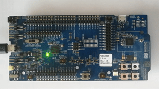

# PWM common mode {#pwm_common_desc}

The sample demonstrates a basic functionality of the nrfx_pwm driver for a sequence loaded in the common mode.

## Requirements

The sample supports the following development kits:


| **Board**           | **Support** |
|---------------------|:-----------:|
| nrf52dk_nrf52832    |     Yes     |
| nrf52833dk_nrf52833 |     Yes     |
| nrf52840dk_nrf52840 |     Yes     |
| nrf5340dk_nrf5340   |     Yes     |
| nrf9160dk_nrf9160   |     Yes     |

## Overview

Application initializes the nrfx_pwm driver.
It plays a simple sequence on LEDs (breathing effect) and replays this sequence @p NUM_OF_LOOPS times.
@p pwm_handler() is executed with a relevant log message after every loop.

> For more information, see **PWM driver - nrfx documentation**.

## Wiring

To run this sample, no special configuration is needed.
You should monitor the output from the board to check if it is as expected.

## Building and running

To run this sample, build it for the appropriate board and then flash it as per instructions in [Building and running](@ref building_and_running) section.

## Sample output

You should see the following output:

```
- "Starting nrfx_pwm example for sequence loaded in common mode."
- "Loops: 1 / 3"
- "Loops: 2 / 3"
- "Loops: 3 / 3"
- "PWM finished"
```
4 LEDs on the development kit should blink in the following sequence:

@cond DOXYGEN_EXCLUDE

@endcond

@image html pwm_common_desc.gif "PWM common example"

[//]: #
[Building and running]: <../../../README.md#building-and-running>
